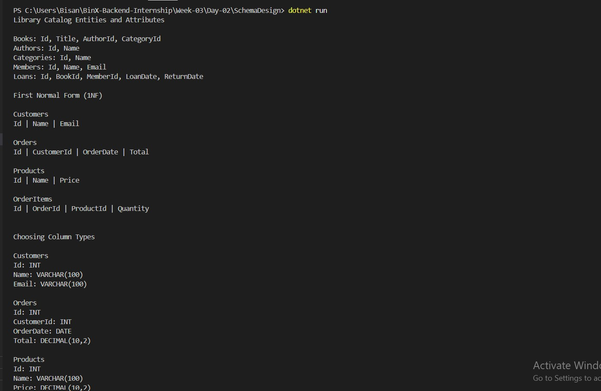
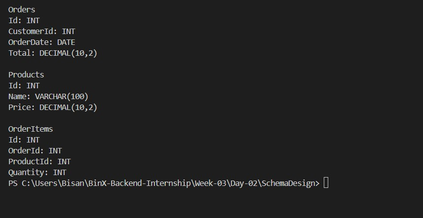
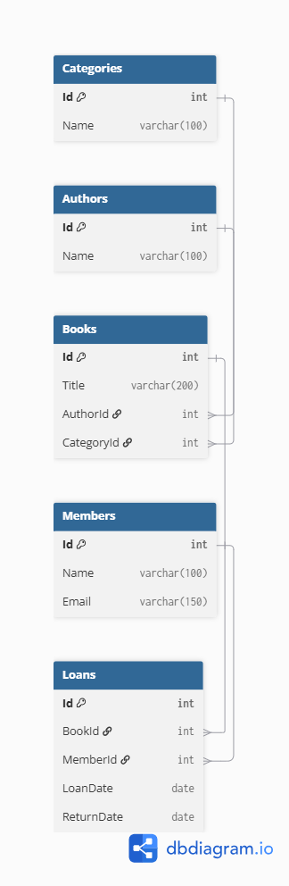

# Day 02 - SQL Server Schema Design & Database Normalization

## Overview

On Day 02, I learned how to design a normalized relational database schema based on the REST API created in Day 01.

The main focus was understanding database normalization, defining relationships between entities, selecting appropriate column types, and creating an Entity Relationship Diagram (ERD).

---

## Topics Covered

- Database Normalization
- First Normal Form (1NF)
- Second Normal Form (2NF)
- Third Normal Form (3NF)
- Primary Keys
- Foreign Keys
- Relationships
- SQL Data Types
- Entity Relationship Diagram (ERD)

---

## Project Domain

Library Catalog

### Entities

- Books
- Authors
- Categories
- Members
- Loans

---

## Database Design

### Primary Keys

- Authors → Id
- Categories → Id
- Books → Id
- Members → Id
- Loans → Id

### Foreign Keys

- Books.AuthorId → Authors.Id
- Books.CategoryId → Categories.Id
- Loans.BookId → Books.Id
- Loans.MemberId → Members.Id

---

## Column Types

| Column | Data Type |
|---------|-----------|
| Id | INT |
| Name | VARCHAR(100) |
| Title | VARCHAR(200) |
| Email | VARCHAR(150) |
| LoanDate | DATE |
| ReturnDate | DATE |

---

## What I Learned

- How to normalize a database schema.
- How to identify entities and their attributes.
- How to define Primary Keys and Foreign Keys.
- How to model relationships between tables.
- How to choose appropriate SQL data types.
- How to design an ERD for a relational database.

---

## Screenshots

### Program Output (Part 1)

---

### Program Output (Part 2)

---

### Entity Relationship Diagram (ERD)

---

## Tools Used

- Visual Studio Code
- C#
- dbdiagram.io
- GitHub

---

## Learning Outcome

By the end of Day 02, I understood how to design a normalized relational database schema, define table relationships, choose appropriate SQL data types, and represent the database structure using an Entity Relationship Diagram (ERD).
