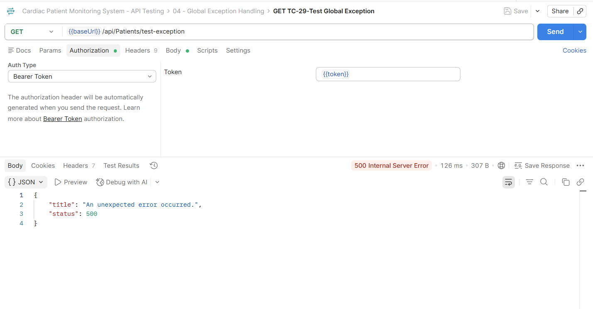
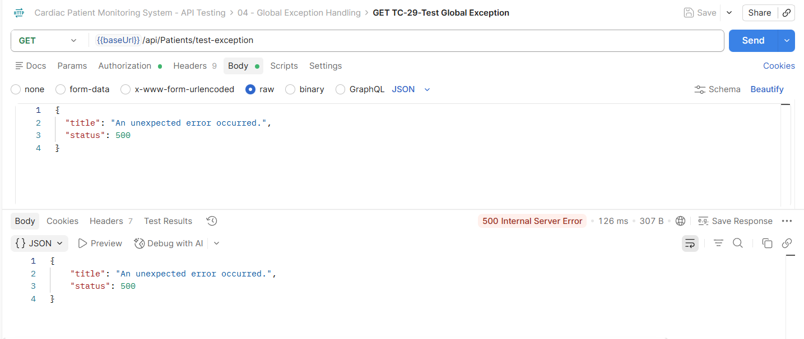
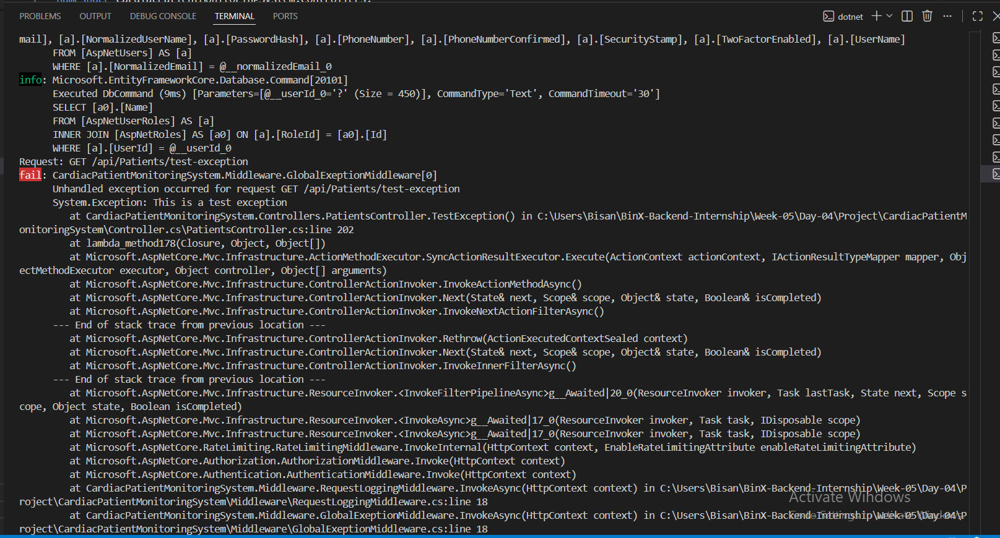

# Day 04 - Centralized Error Handling & Global Exception Middleware

## What I Learned

Today I learned how to handle errors in one place instead of using try/catch inside every endpoint.

I worked with:

- Global Exception Middleware
- ProblemDetails
- Structured Logging
- ILogger

## What I Did

I added a global exception middleware to the Cardiac Patient Monitoring System.

The middleware catches unhandled exceptions and returns a standard error response using ProblemDetails.

I also added logging using ILogger so the exception details are logged on the server without showing them to the client.

To test the middleware, I created a test endpoint that throws an exception.

The API returned:

- Status Code: 500 Internal Server Error
- Title: An unexpected error occurred.

The real exception details appeared in the server logs and were not returned in the API response.

I also checked the project for unnecessary try/catch blocks inside the controllers.

## Screenshots

### Global Exception Handling

I tested the global exception middleware by sending a request to the test exception endpoint.

The API returned a 500 Internal Server Error with a standard error response.

The response did not show the real exception details to the client.

### Structured Logging

The real exception details were logged in the server terminal.

## Result

The global exception handling worked successfully.

The API returned a consistent error response without exposing internal exception details, while the real exception information was logged on the server.